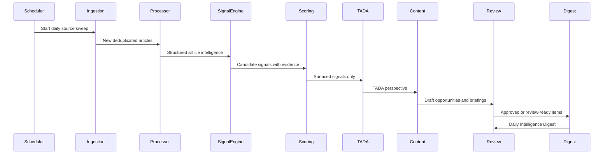
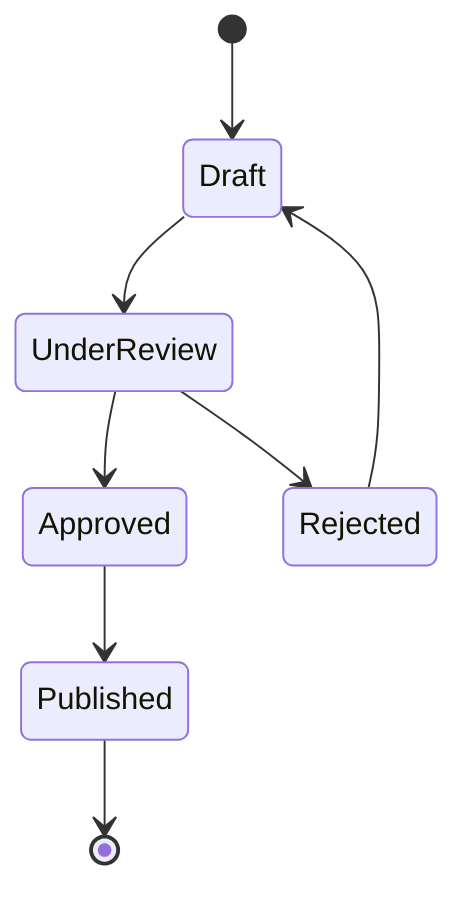
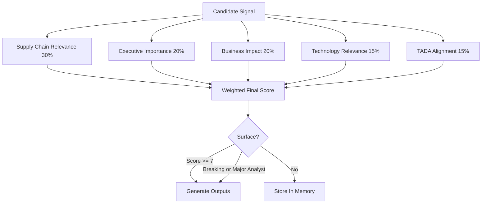
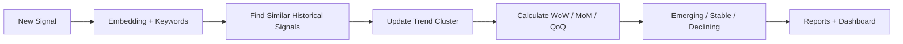

# Workflow Diagrams

## Daily Intelligence Flow

```mermaid
sequenceDiagram
  participant Scheduler
  participant Ingestion
  participant Processor
  participant SignalEngine
  participant Scoring
  participant TADA
  participant Content
  participant Review
  participant Digest

  Scheduler->>Ingestion: Start daily source sweep
  Ingestion->>Processor: New deduplicated articles
  Processor->>SignalEngine: Structured article intelligence
  SignalEngine->>Scoring: Candidate signals with evidence
  Scoring->>TADA: Surfaced signals only
  TADA->>Content: TADA perspective
  Content->>Review: Draft opportunities and briefings
  Review->>Digest: Approved or review-ready items
  Digest->>Review: Daily Intelligence Digest
```

## Human Review Workflow

```mermaid
stateDiagram-v2
  [*] --> Draft
  Draft --> UnderReview
  UnderReview --> Approved
  UnderReview --> Rejected
  Approved --> Published
  Rejected --> Draft
  Published --> [*]
```

## Signal Scoring

```mermaid
flowchart TD
  A["Candidate Signal"] --> B["Supply Chain Relevance 30%"]
  A --> C["Executive Importance 20%"]
  A --> D["Business Impact 20%"]
  A --> E["Technology Relevance 15%"]
  A --> F["TADA Alignment 15%"]
  B --> G["Weighted Final Score"]
  C --> G
  D --> G
  E --> G
  F --> G
  G --> H{"Surface?"}
  H -->|"Score >= 7"| I["Generate Outputs"]
  H -->|"Breaking or Major Analyst"| I
  H -->|"No"| J["Store In Memory"]
```

## Trend Memory

```mermaid
flowchart LR
  Signal["New Signal"] --> Embed["Embedding + Keywords"]
  Embed --> Match["Find Similar Historical Signals"]
  Match --> Cluster["Update Trend Cluster"]
  Cluster --> Velocity["Calculate WoW / MoM / QoQ"]
  Velocity --> Status["Emerging / Stable / Declining"]
  Status --> Reports["Reports + Dashboard"]
```

